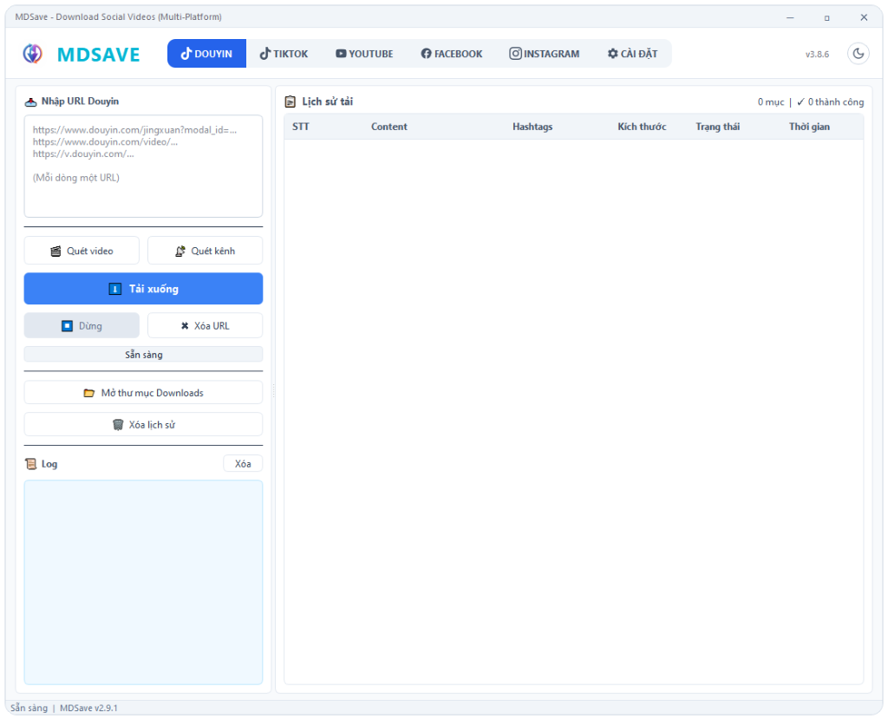

# MDSave - Download Social Videos (Multi-Platform)

Ngôn ngữ: [🇺🇸 **English**](README.md) | 🇻🇳 **Tiếng Việt**

---

Ứng dụng khách (client-side app) hỗ trợ phân tích và tải xuống video đa phương tiện từ nhiều nền tảng mạng xã hội lớn, được thiết kế tối ưu hiệu suất, an toàn và bảo mật.

### Ảnh chụp màn hình ứng dụng

### Tính năng nổi bật & Công nghệ tích hợp
- **Giao diện người dùng hiện đại**: Xây dựng trên nền tảng framework PyQt5 mang lại trải nghiệm tương tác mượt mà, tối ưu hóa bố cục trực quan cho các thao tác tải và quản lý.
- **Công nghệ tải đa luồng hiệu năng cao**: Tích hợp các bộ thư viện truyền tải dữ liệu tiên tiến (`curl_cffi` mô phỏng TLS Fingerprint của các trình duyệt hiện đại) kết hợp cùng động cơ tải xuống đa luồng song song (`aria2c`), giúp tối ưu hóa băng thông đường truyền và đạt tốc độ tải cực đại.
- **Cơ chế xử lý yêu cầu thông minh**: Tự động tối ưu hóa cấu trúc các gói tin HTTP Request, vượt qua các hàng rào kiểm soát tần suất truy cập (Rate Limit) một cách an toàn và bảo mật.
- **Quản lý hàng đợi bất đồng bộ**: Kiến trúc đa luồng (Multi-threading) quản lý danh sách tải xuống song song, đảm bảo ứng dụng hoạt động ổn định, không gây nghẽn giao diện (UI Freeze) ngay cả khi đang tải hàng loạt danh mục lớn.
- **Lưu trữ lịch sử an toàn**: Hệ thống cơ sở dữ liệu lưu trữ lịch sử tải xuống cục bộ gọn nhẹ, hỗ trợ tìm kiếm nhanh và khôi phục trạng thái tác vụ dễ dàng.

### Hướng dẫn sử dụng cho người dùng
1. Giải nén tệp tin `MDSave.zip` vừa tải về từ trang [Releases](https://github.com/mindeskvn/MDSave/releases).
2. Chạy tệp tin `Setup.bat` để chương trình tự động cấu hình và cài đặt môi trường/thư viện cần thiết.
3. Sau khi quá trình cài đặt hoàn tất, chạy tệp tin `main.exe` để mở và sử dụng ứng dụng.
